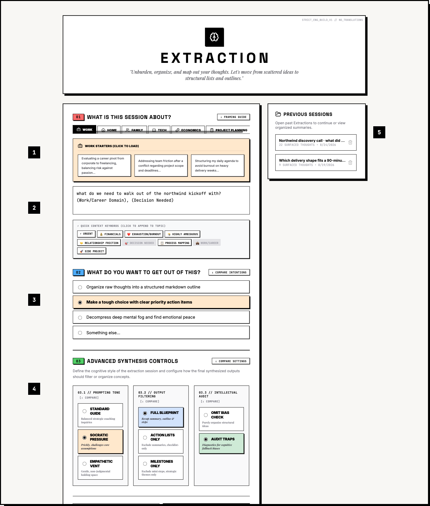
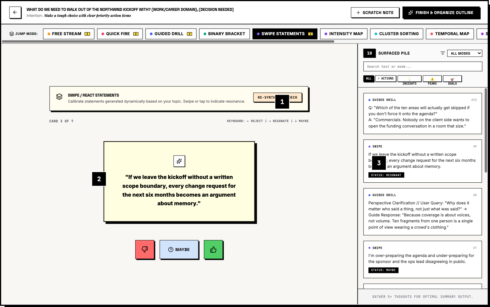
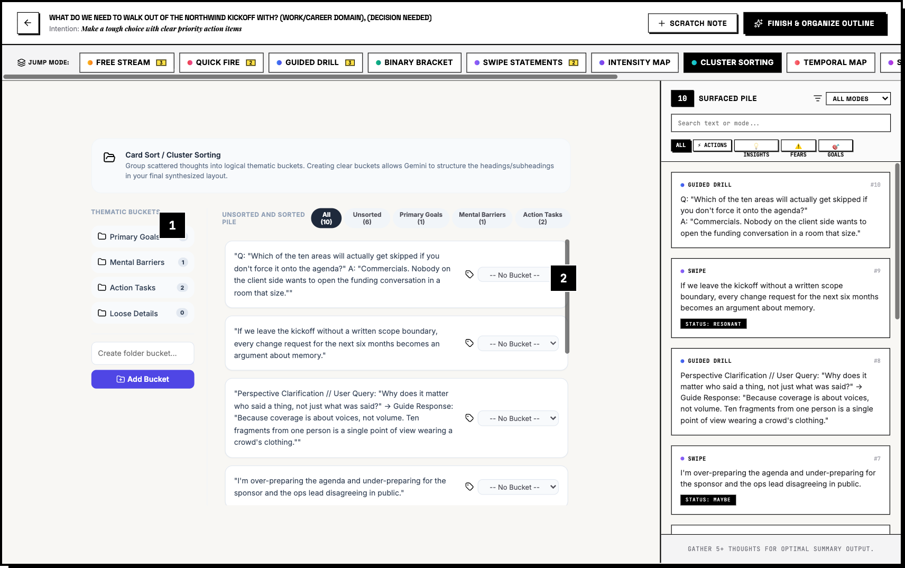
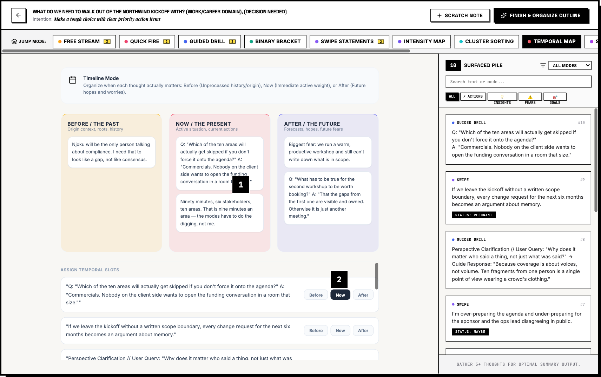
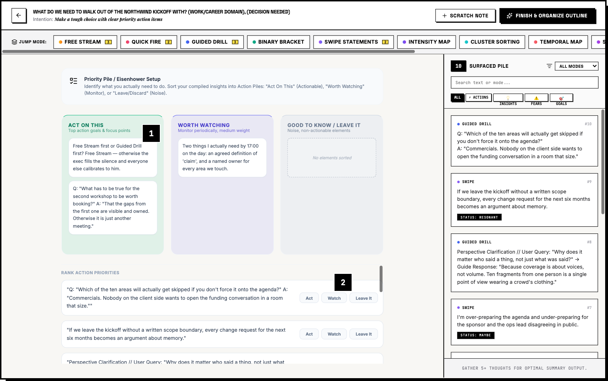
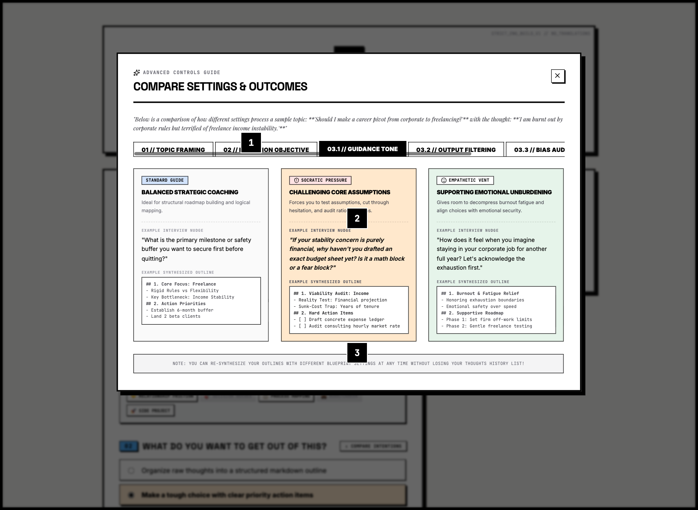

# ⊞ EXTRACTION

**Extraction** gets thoughts out of your head and into a structure you can act on. Twelve
interaction modes surface fragments into a pile; a model synthesizes the pile into an outline,
a summary, and a list of actions.

It runs two ways from one codebase — **solo**, with fragments in `localStorage` and no backend
to speak of, and **group**, with a whole room contributing to one shared pile on the server
behind Identity-Aware Proxy. Which one you get is decided by configuration, not by a build flag.



_Screenshots are annotated walkthroughs; numbered callouts mark the pieces described in the
[design records](planv1/)._

---

## Configuration decides behavior

There is no `MODE=` switch anywhere in this app. Every backend selects itself by the presence
of the configuration it needs, which is what lets a fresh clone run end to end with no cloud
account, no API key, and no setup beyond `npm install`.

| Seam         | Unconfigured                         | Configured                                    |
| :----------- | :----------------------------------- | :-------------------------------------------- |
| **Identity** | `AUTH_MODE=dev` asserts a local user | `iap` verifies the IAP JWT on every request   |
| **Storage**  | JSON file under `.data/`             | Firestore, when `FIRESTORE_PROJECT_ID` is set |
| **Model**    | Static fallbacks, labelled as such   | Gemini via Vertex ADC, or a Developer API key |

Two of those three degrade quietly by design. The third does not, and that distinction is the
interesting part — see [Degradation is declared](#degradation-is-declared).

## The AI layer

All model calls are proxied server-side under `/api/session/*` and `/api/engagement/*`, so no
credential ever reaches the browser. Four things are worth reading the code for:

**Schema-constrained decoding, not prompt-and-hope.** Every route sends a `responseSchema` with
`responseMimeType: "application/json"`, so the shape is enforced during decoding rather than
requested in prose and repaired afterwards. `JSON.parse` on the result is parsing a contract,
not gambling on one.

**Prompts are pure functions.** They live in [server/ai/sessionPrompts.ts](server/ai/sessionPrompts.ts)
and [server/ai/levelSetPrompt.ts](server/ai/levelSetPrompt.ts), each a plain function of its
input with no request plumbing in scope, so a prompt change is a readable diff. The solo
synthesis prompt and the group level-set prompt are deliberately _not_ reworded versions of
each other — one is a recap of what one person uncovered, the other states the boundary of an
ask that ten people will be held to.

**Arithmetic the model is not asked to do.** Coverage — including which areas _nobody_ raised —
is computed in [server/ai/coverage.ts](server/ai/coverage.ts) from classified fragments. The
model assigns each fragment to one area from a bounded list, which it is reliable at; counting
is done in TypeScript, because the headline of a level set is the zero and a zero has to be
right every time.

**The model chain only answers one question.** `GEMINI_MODELS` lists ids to try in order,
because valid ids differ between the Developer API and Vertex and move faster than this repo
does. That chain advances only for "this id is not served here" — a 400, 401 or 403 answers
identically for every model, so it stops immediately and reports the real status instead of
burning a round trip per model and calling it an outage. Transient failures never reach the
chain at all: the SDK's own backoff handles 408/429/5xx against the same model, so a blip
never silently demotes a request to a weaker one. Only 429 is passed through to the caller,
since it is the only status they can act on. See [server/ai/client.ts](server/ai/client.ts).

**One model call per engagement at a time.** Synthesis is single-flight and versioned against
the pile it was built from, so ten people opening the review panel join one run instead of
racing ten, and a deliverable built from a stale pile says so.

### Degradation is declared

Every AI route has a static fallback, and the app stays fully usable with no model configured.
That is the property that makes this deployable as a workshop exercise on a laptop with no
key — but canned output is shaped exactly like generated output, so a misconfigured deployment
otherwise looks like a working one that has gone bland.

So the substitution is never silent. It is announced in three places:

```console
$ curl -s -D- localhost:3000/api/session/devils-advocate -d '{"topic":"..."}' \
    -H 'Content-Type: application/json'
X-Extraction-AI-Source: fallback
{
  "challenges": ["..."],
  "source": "fallback",
  "notice": "AI is not configured on this server, so this response is a fixed
             placeholder and is not tailored to the session. ..."
}
```

— a response header for anything that never parses a body, a `source` field on the body, and a
banner in the UI driven by `/healthz`. The group level set is the deliberate exception: it
refuses to generate at all rather than write plausible filler into a document that gets
circulated to a client. A failure is summarised rather than echoed — Gemini and Firestore error bodies both name
the project — unless it is explicitly marked as written for the caller. See
[server/ai/respond.ts](server/ai/respond.ts).

## Architecture notes that aren't obvious

- **`Session.engagementId` is the mode switch.** Present means group, absent means solo. One
  session type, one set of mode components, two persistence paths.
- **[engagementSync.ts](src/utils/engagementSync.ts) never infers a deletion from a fragment's
  absence.** Modes compose whole new `thoughts` arrays from a possibly-stale snapshot, so
  absence means "older than the server", not "removed". Deletion is an explicit call. This
  looks like an array diff waiting to happen and is deliberately not one.
- **`AUTH_MODE` fails closed at boot.** [server/authMode.ts](server/authMode.ts) resolves the
  identity configuration once at startup and **exits the process** on an inconsistent one — a
  missing `IAP_AUDIENCE` in production, or `dev` in production — rather than discovering it
  per-request and serving unverified identities in the meantime.
- **Share links are base64url, not base64.** A session packs into a query parameter, where
  standard base64's `+` is the wire form of a space; `URLSearchParams` hands back a space,
  `atob` drops it as whitespace, and every byte after it shifts. A single `~` in a fragment was
  enough to trigger it. See [shareLink.ts](src/utils/shareLink.ts) and its tests.
- **The server bundle is built outside `dist/`.** The client bundle is served statically; the
  compiled server and its sourcemap go to `dist-server/` so they are never fetchable over HTTP.

## The twelve modes

Each mode is a different way of getting a fragment out of someone. They write into one pile,
and the pile is what gets synthesized.

| Mode                    | What it does                                                                      |
| :---------------------- | :-------------------------------------------------------------------------------- |
| **Guided Drill**        | Adaptive interview. Answer, or switch to chat and challenge the interviewer back. |
| **Free Stream**         | Uninterrupted block writing. A nudge appears only after ten idle seconds.         |
| **Quick Fire**          | Speed dump. Write, Enter, cleared — build mass fast.                              |
| **Swipe / React**       | Card deck of generated candidate statements; swipe to categorize resonance.       |
| **Binary Frame**        | Two opposing first-person framings; pick the one that stings.                     |
| **Slider Map**          | Rate a fragment on urgency, certainty, or emotional charge.                       |
| **Card Sort**           | Cluster loose fragments into buckets you name yourself.                           |
| **Timeline**            | Sort fragments by when they matter — before, now, after.                          |
| **Sentence Completion** | Finish the stem. Bypasses the editing voice.                                      |
| **Devil's Advocate**    | Three sharp challenges to whatever you have surfaced so far.                      |
| **Letter Writing**      | Write to a person involved, or to yourself in a year, without sending.            |
| **Priority Pile**       | Triage the pile into act on this, worth watching, and leave it.                   |

Adding one means touching `VALID_MODES` in both [src/App.tsx](src/App.tsx) and
[server/store/shape.ts](server/store/shape.ts).

|                                                         |                                                          |
| :------------------------------------------------------ | :------------------------------------------------------- |
|    |         |
| **Guided Drill** — adaptive interview with a chat pivot | **Swipe / React** — categorize by resonance              |
|    |     |
| **Card Sort** — cluster into buckets you name           | **Timeline** — before, now, after                        |
|  |  |
| **Slider Map** — rate urgency, certainty, charge        | **Priority Pile** — act, watch, or leave it              |

### Synthesis

The pile becomes a summary, a markdown outline, and an action list — re-formattable without
re-running the session. Tone (standard / Socratic / empathetic), output filter (full blueprint
/ milestones / checklist) and an optional cognitive-bias audit are prompt parameters, and the
same tone the user picks at intake is the one they meet in the drill, in the sidebar dialogue,
and again here.




## 👥 Group mode — one shared pile

Extraction also runs as a **hosted, authenticated instance** where a whole room contributes to
a single pile over an engagement. The twelve extraction modes are unchanged; what changes is
who can reach the pile and whether a fragment remembers who said it.

- **A fragment remembers who said it.** Contributions are stamped server-side with the
  verified contributor's identity and role — never typed in, never accepted from the client.
- **Nobody rewrites anyone.** Only the author may edit or delete their own words. _Filing_ a
  card — cluster, timeline zone, priority, intensity, swipe — is open to any member, because
  sorting the pile together is the point of sharing it. Enforced server-side, not just hidden
  in the UI.
- **The pile keeps growing after the room empties.** Anyone in the group can contribute at any
  time; a `?engagement=<id>` link drops the whole room into the same pile.
- **No accounts.** Identity comes from the client's own directory through Identity-Aware
  Proxy. The app holds no credentials, and removing someone from the group removes their
  access.
- **The pile answers back.** With **Chorus** on, committing a fragment shows you the ones
  already in the pile that share its uncommon words, labelled by role — or states that nothing
  in the pile is near it. Twelve people writing at once is twelve parallel monologues
  otherwise, and a fragment only one person ever raised is the thing a coverage map cannot
  see: an area can read green with every fragment in it a lone voice. Lexical and
  deterministic, computed in the browser, no model involved in either the finding or the
  wording — and it fires only _after_ a contribution, never while one is being typed, so it
  cannot anchor the independence it is measuring. Per viewer, one click to turn off.
- **The level set is a group deliverable.** Explicit and single-flight rather than generated
  on render, versioned against the pile it was built from, and marked stale when the pile
  moves on. Coverage — including which areas _nobody_ raised — is computed by arithmetic over
  classified fragments rather than asked of the model.

Solo mode is untouched: sessions still live in `localStorage`, and a session with no
engagement renders exactly as it always has.

## 🚀 Running it

```bash
npm install
npm run dev          # :3000, AUTH_MODE=dev identity, no configuration required
```

That is the whole setup. With nothing configured the app runs solo against a local JSON store
with labelled fallback prompts. Add a `GEMINI_API_KEY` to `.env` (`cp .env.example .env`) for
real generation; add `FIRESTORE_PROJECT_ID` and `AUTH_MODE=iap` for the group path.

| Command         | What it does                                                           |
| :-------------- | :--------------------------------------------------------------------- |
| `npm run dev`   | Server + Vite middleware on :3000.                                     |
| `npm run check` | The verification loop: `format:check`, `lint`, `test`.                 |
| `npm run lint`  | `tsc --noEmit`.                                                        |
| `npm run build` | Vite client build + esbuild server bundle to `dist-server/server.cjs`. |
| `npm test`      | `node:test` via tsx.                                                   |

For a two-person local test of the shared pile, run one server and pin a different identity
per browser profile with `?dev_user=someone@example.com`.

### Tests

```bash
npm test
```

Boots a real server against an isolated file store, with no cloud configuration and no Gemini
key. Covers attribution, field-level authorship, the concurrent-contribution regression, ETag
revalidation, the CSRF content-type gate, synthesis failure handling, share-link encoding, the
coverage arithmetic, and the chorus — its links, its refusals, and the wording of the card that
reports them.

## ☁️ Deployment

The app deploys to **Cloud Run behind IAP**, with **Firestore** holding the shared pile and
**Vertex AI** serving the model as the runtime service account — so a deployment holds no API
key material at all.

```bash
export PROJECT=your-project-id
./scripts/bootstrap-gcp.sh   # idempotent, once
./scripts/deploy.sh
```

See **[DEPLOYMENT.md](DEPLOYMENT.md)** for the full walkthrough, including the one manual
console step and how to grant the engagement group access.

## 🔒 Environment

Everything below is optional. Never prefix a secret with `VITE_` — that publishes it to the
browser. See [`.env.example`](.env.example) for the annotated list.

| Variable                           | Purpose                                                                   |
| :--------------------------------- | :------------------------------------------------------------------------ |
| `GEMINI_API_KEY`                   | Gemini Developer API key. Easiest for local development.                  |
| `GENAI_BACKEND`                    | `apikey` (default) or `vertex`. Vertex uses ADC — no key material.        |
| `VERTEX_LOCATION`                  | Region, when `GENAI_BACKEND=vertex`.                                      |
| `GEMINI_MODELS`                    | Comma-separated model chain. Ids differ per backend and change over time. |
| `AUTH_MODE`                        | `iap` verifies the IAP assertion; `dev` asserts a local identity.         |
| `IAP_AUDIENCE`                     | Expected JWT audience. Computed for you by `scripts/deploy.sh`.           |
| `FIRESTORE_PROJECT_ID`             | Set to use Firestore; unset falls back to a local JSON file.              |
| `DEV_USER_EMAIL` / `DEV_USER_NAME` | The identity assumed under `AUTH_MODE=dev`.                               |
| `PORT`                             | Listen port. Defaults to 3000; Cloud Run injects its own.                 |
| `DIST_DIR`                         | Static root under `NODE_ENV=production`. Defaults to `./dist`.            |

## 🎨 Design language

The interface is Neo-Brutalist and deliberately physical: heavy black outlines
(`border-3 border-black`), hard offset shadows (`shadow-hard-4`), no gradients, and Space
Grotesk / JetBrains Mono pairings. Colour is functional rather than decorative — each fragment
type carries one: ⚡ actions coral, 💡 insights blue, ⚠️ risks yellow, 🎯 goals green.

Tailwind v4, no component library. New mode components match their neighbours in
[src/components/Modes/](src/components/Modes/) rather than inventing styling.

**It follows your system's dark mode, and the control at the bottom left overrides it** —
system, light, dark. Ink and paper swap rather than soften: the border and the hard shadow
become light on a dark ground, so the idiom survives instead of dissolving into it. The whole
theme is one block in [src/index.css](src/index.css), because Tailwind v4 compiles every
palette utility to a custom property and remapping those re-themes the app without a single
`dark:` variant in a component. The rule that keeps it working is that a component names a
token and never a colour; [test/theme.test.ts](test/theme.test.ts) enforces it.

## Stack

TypeScript ESM throughout. React 19 + Vite + Tailwind v4 on the client; Express on the server,
run by `tsx` in development and bundled by `esbuild` for production. `@google/genai` against
Vertex AI or the Gemini Developer API. Firestore or a local JSON file. Cloud Run behind IAP.
No ESLint — `tsc --noEmit` is the lint step.

Design records and plans live in [planv1/](planv1/), committed with their provenance. Where
this is likely to go next — an MCP server over the pile, a provider-neutral model seam, local
models in solo mode, Claude served from the same GCP project, a no-model listening mode,
a status board in the same visual idiom, and optional local assists on a draft before it is
submitted —
is written up in [docs/intents/](docs/intents/).
