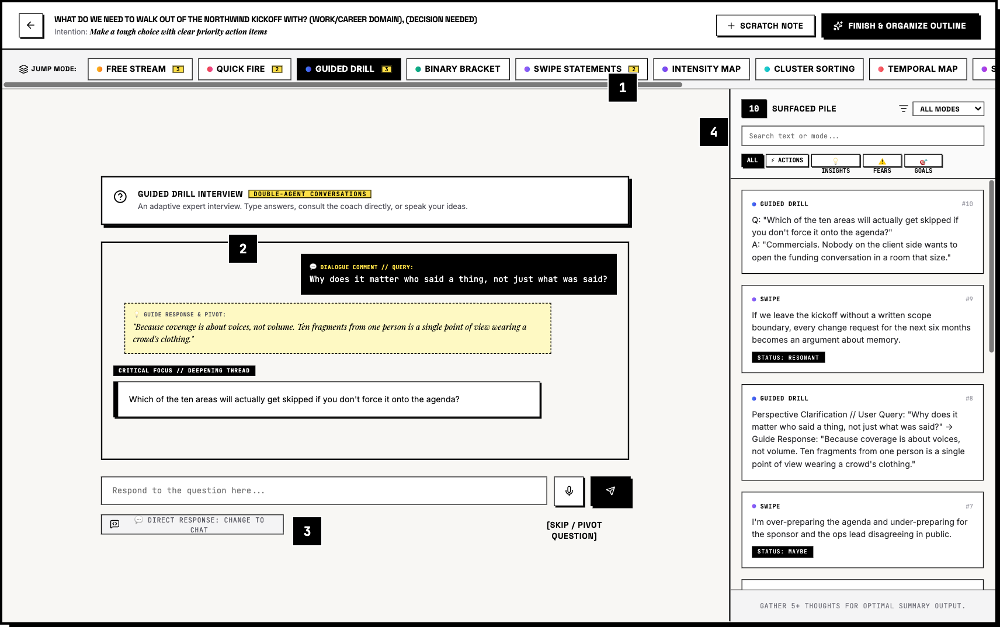
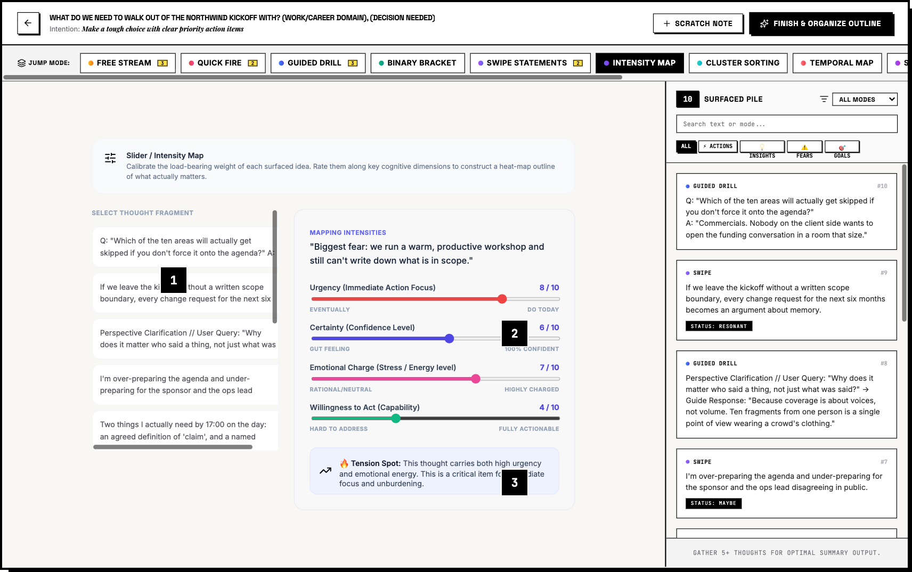
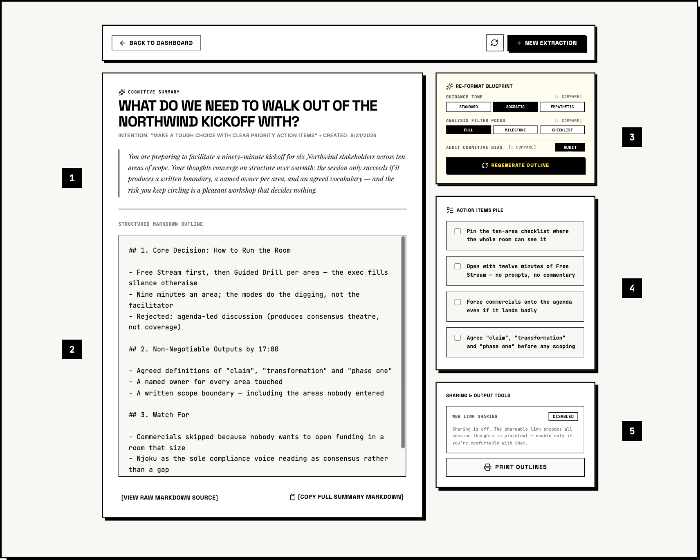

# ⊞ EXTRACTION — Cognitive Chamber & Strategic Consultant

**Extraction** is a tactile, highly conversational thought-extraction chamber and executive outline synthesizer. Crafted in a high-contrast Neo-Brutalist design language, it helps you step out of mental paralysis, unpack scattered thought fragments, categorize them into structural dimensions, and synthesize crisp action strategies.

```bash
echo "GEMINI_API_KEY=your-key" > .env
npm install
npm run dev          # full-stack dev server on :3000
```

---

## 🎬 Walkthrough — one session, start to finish

Every screenshot below comes from the same session: an engagement architect, alone the night before a client kickoff, working out **what the room actually has to produce**. Ten scattered fragments in, an executive blueprint out.

### 01 · Frame the session


The dashboard is the whole setup. Six domain tabs (Work, Home, Family, Tech, Economics, Project Planning) each load three ready-made prompt starters; one-tap context keywords append constraints like `(Decision Needed)` straight into your topic. Then you pick an **intention** — organize an outline, force a decision, or decompress — and the **advanced synthesis controls**: guidance tone, output filtering, and whether to run a cognitive bias audit.

Don't want to choose? **Guide Me** runs a four-question warm-up diagnostic and recommends a mode with a confidence score and two alternates.

### 02 · See what each setting does before you pick


Every control has an `ℹ Compare` affordance. It opens a six-tab guide that runs one fixed sample topic through each option — showing the interview nudge it would ask and the markdown it would produce. Socratic audits read very differently from an empathetic mirror.

### 03 · Guided Drill — argue with the interviewer



An adaptive interview that writes its next question from your last answer. The difference from a normal chatbot: you can stop answering and **interrogate the interviewer instead** (Conversational Mode) — here, asking why authorship matters at all — get a clarifying reply, and be handed back to the thread. The mic dictates either one. Every exchange lands in the **Surfaced Pile** on the right — searchable, filterable by mode, and auto-tagged as ⚡ Actions / 💡 Insights / ⚠️ Fears / 🎯 Goals.

The mode tape across the top switches between all twelve modes mid-thought without losing the pile.

### 04 · Swipe deck — react instead of compose


When writing is the blocker, the engine writes candidate beliefs about your topic and you only judge them. Arrow keys work: `←` rejects, `→` resonates, `↓` is a maybe. Swiped cards keep their verdict in the pile as `STATUS: RESONANT`, and the synthesis weights them accordingly.

### 05 · Cluster sort — name the buckets yourself


Sorting isn't busywork: the buckets you create become the **headings of the synthesized outline**, so you decide the document's skeleton before the engine writes it.

### 06 · Temporal map — before, now, after


The same pile re-read as a chronology: origin context, live pressure, forecasts and future fears. Useful for separating what already happened from what you're only anticipating — an empty zone is itself a signal.

### 07 · Intensity map — weigh what you surfaced



Ten fragments all look equally important on a list. Rating them on urgency, certainty, emotional charge, and willingness to act produces the heat map the synthesis uses to decide what leads. High urgency + high emotion gets flagged as a **tension spot** — the thing you're most likely avoiding.

### 08 · Priority Eisenhower — three piles, no more


The last filter before synthesis. Act on it, watch it, or admit it's noise. Deliberately coarse: three piles force a call where a five-point scale lets you defer. Whatever lands in **Act On This** becomes the action checklist.

### 09 · The executive blueprint



Ten scattered fragments come back as a facilitation plan: how to run the room, what must exist by 17:00, and what to watch for. **Re-Format Blueprint** swaps tone, swaps focus, and toggles the bias audit — regenerating the document without touching the thought history, so one session can produce three different deliverables. Print, or share via a self-contained link (off by default: the link encodes the session in plaintext, and the UI says so).

---

## 🧭 All twelve extraction modes

| Mode | What it's for |
| :--- | :--- |
| **Free Stream** | No prompts. Unfiltered typing, mic optional. |
| **Quick Fire** | Speed prompts, one-line answers, instant clear. Build mass fast. |
| **Guided Drill** | Adaptive expert interview with a conversational dialogue pivot. |
| **Binary Bracket** | Choose between contrasting framings of the same issue. |
| **Swipe Statements** | Judge generated beliefs instead of writing your own. |
| **Intensity Map** | Rate urgency, certainty, emotional charge, actionability. |
| **Cluster Sorting** | Bucket fragments; buckets become outline headings. |
| **Temporal Map** | Split past origin, present pressure, future forecast. |
| **Sentence Starters** | Complete stems to surface what you avoid saying. |
| **Advocate Shock** | The engine attacks your position on purpose. |
| **Letter Drill** | Write to a person, not a form. Loosens feeling. |
| **Priority Eisenhower** | Act, watch, or leave it. Three piles, one call. |

---

## 🎨 Visual identity

An editorial, high-contrast, tactile desktop layout — not soft purple gradients.

- **Neo-Brutalist frame**: heavy black outlines (`border-3 border-black`), blocky hard shadows (`shadow-[4px_4px_0px_0px_rgba(0,0,0,1)]`), **Space Grotesk / Outfit** for headers, **JetBrains Mono / Fira Code** for metadata.
- **Functional pastel palette**, one hue per thought type: ⚡ Actions `#FF6B6B` · 💡 Insights `#4DABF7` · ⚠️ Fears `#FFD43B` · 🎯 Goals `#51CF66`.

---

## 🛠️ Architecture & setup

Express API proxy in tandem with **Vite** and TypeScript. Server-side code compiles on build into a single stand-alone target via `esbuild`, bypassing strict Node ESM runtime checks and speeding up cold starts.

```json
{
  "scripts": {
    "dev": "tsx server.ts",
    "build": "vite build && esbuild server.ts --bundle --platform=node --format=cjs --packages=external --sourcemap --outfile=dist/server.cjs",
    "start": "node dist/server.cjs"
  }
}
```

## 🔒 API key & environment security

All AI calls are proxied server-side through `/api/session/*`, so credentials never reach a client-side network inspector.

```env
GEMINI_API_KEY=your-high-security-google-genai-key-here
```

Do **not** prefix it with `VITE_` — that would expose it to the browser. Every mode also falls back to local logic when the API is unreachable, so the interface stays usable without a key.

Sessions themselves are stored in the browser only. No accounts, no upload, sharing opt-in per session.
